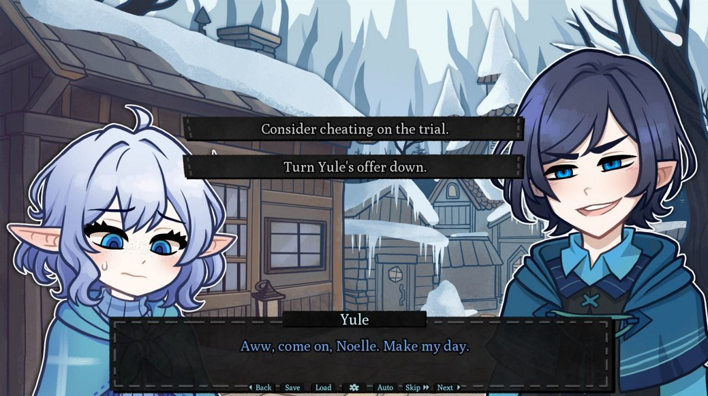

# Final Project Proposal

## Brief Overview
- For my final project, I would like to make a short visual novel type game with Ren'Py.

## References

#### 1: No Good Noelle
- [No Good Noelle](https://vndb.org/v41422)
- This is a short indie visual novel game (around 1 hour playtime). It's purely just clicking through the story and making choices, and you can get either a good or bad ending. 
- I've played this game before, but I had to download it through a game archive, as the developer has taken down all their games from itch.io. (There is no official site for this game anymore.)
- Of my three references this game is probably the closest to what I want my final project to be like. 

#### 2: Doki Doki Literature Club 

- [Doki Doki Literature Club](https://store.steampowered.com/app/698780/Doki_Doki_Literature_Club/)
- This is another visual novel, and was actually made with Ren'Py!!
- It includes cool gameplay elements where you actually have to go into the game files to literally delete character files in order to defeat a character, and has cool visual changes to the UI to reflect the progression of the story. 
- This game heavily relies on choices to give specific endings, and every choice matters (unlike some games with visual novel aspects, where choice is more or less an illusion and more for interactivity). 
- Also fun fact this game is actually tagged psychological horror. The dating sim premise is lowkey bait. It's an awesome game 

#### 3: Danganronpa: Trigger Happy Havoc
- [Danganronpa: Trigger Happy Havoc](https://store.steampowered.com/app/413410/Danganronpa_Trigger_Happy_Havoc/)
- This is also another visual novel, and focuses on investigating murders and pieceing clues together. 
- Involves point and click gameplay.
- Also relies on picking certain choices to ensure specific endings. 

## Less brief overview
- This project does not overlap with work from any of the classes I am currently taking.
- This will, however, be a particularly relevant project for me as I am currently also majoring in GAIMS.
- While some of my examples are games that involve aspects OTHER than being a click-through visual novel, I expect my Ren'Py project to purely be a visual novel without any other kind of gameplay aspects. 

## Potential Outcome Evaluation

### Good Outcome
- 50% of the game complete. 
- Most visuals are included, and completed document with script of the game. Visuals include:
  - Most character sprites
  - Background images
  - UI (dialogue textbox, game start screen, menu screen), simplified 
- 2 endings (good and bad)
    
### Better Outcome
- 75% of game complete.
- All visuals included
	- UI visuals are more refined than good outcome, possibly include ability to save? 
	- All character sprites included
- 3 endings (good, bad, and an alternative ending)

### Best Outcome
- Game is 100% complete 
- All visuals and full dialogue script included. 
- Also able to incorporate sfx/music assets. 
- Possibly 4 endings

## Projected Timeline and Steps
1. Contact artist to ask about making sprites and background scenes (by 2 April)
2. Write out general plotline for the entire story, including all choice branches leading to outcomes/other crucial choices (by 9 April)
3. Create script that includes all dialogue (by 16 April)
4. All visual aspects should be submitted by 20 April
5. Code game in Ren'Py, follow the manual on Ren'Py official website for help
	- Aim to finish by 27 April
6. Fine tuning UI (dialogue box, start up screen, menu), test runs of the game
    - By 2 May
7. Implement any sfx and possibly music by 6 May
8. Submit on 7 May