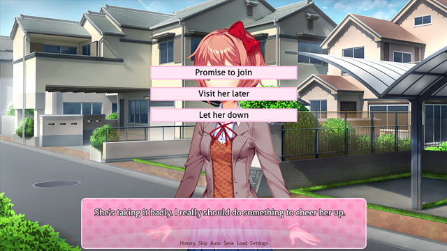
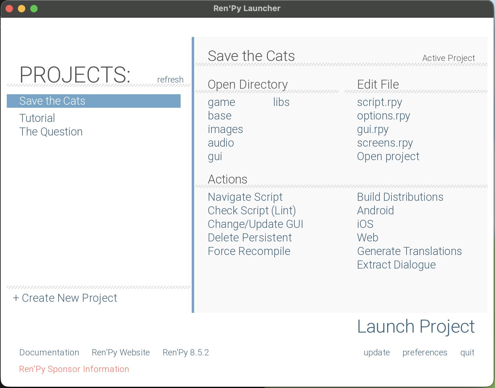
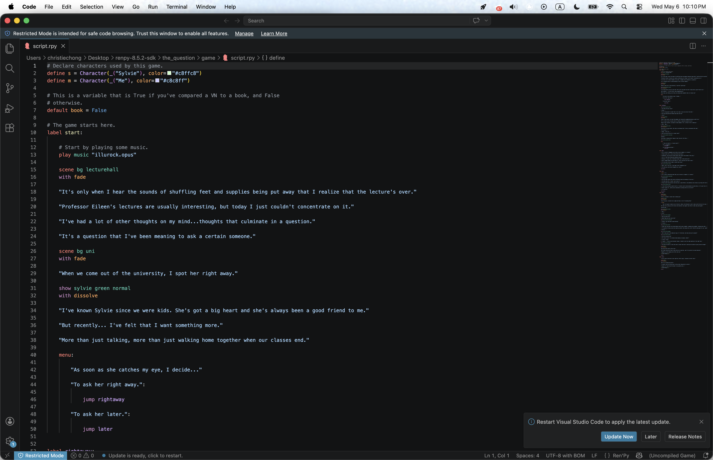

# FINAL PROJECT

## What I did
 - I made a visual novel game with Ren'Py!
 - Here are some of the games that I referenced: 
   - [Doki Doki Literature Club](https://store.steampowered.com/app/698780/Doki_Doki_Literature_Club/)
   

   - [No Good Noelle](https://vndb.org/v41422)
   

  

## Problems I faced and how I solved them
  - Honestly, not many. 
  - When you launch Ren'Py, it actually comes with two example games: "The Question" and a tutorial game which is literally just a tutorial lol.
  

  
  
  - So to learn how to code in Ren'Py, I just opened up the script of these games (you can see the option to open the script.rpy file under Edit File) and referenced them.

   
  - The Ren'Py website also has a [Quickstart Manual](https://www.renpy.org/doc/html/quickstart.html) that literally documents everything. 
     - For example, they tell you how to resize your image files to appear smaller in the game without having to actually resize them and reupload them. 
     - For my game, my character sprites were too big so I had to resize them by naming them "xxx@2. png". The @2 scales the images down by half. 
	 
	Before resizing 
	
	
	
	After resizing 
	
	

	

## Outcome? 
- For this project I think I overestimated myself. For some reason I expected myself to manage to create a full length visual novel but obviously I did not do that.
- I have a bunch of sprites that are in the game image files that I never got to use because I never made it far enough in the narrative to bring these characters out (script writing is really hard and I'm not talking about programming).
- This is probably what I'd consider a "Good Outcome" - It's more of an introductory demo to the game's story and I basically have most if not all of the visuals I needed. 