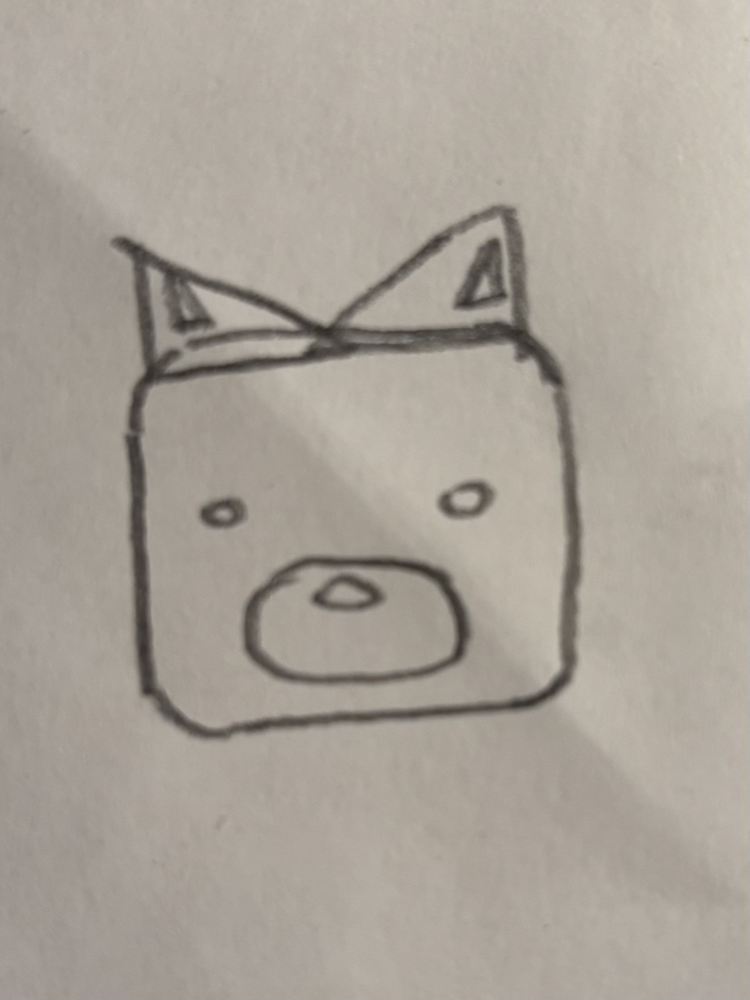
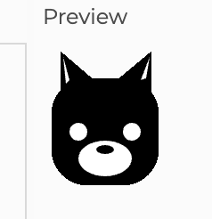
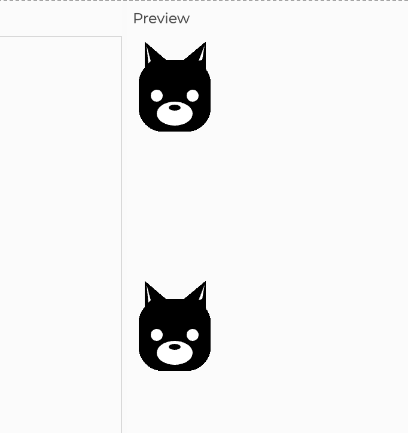
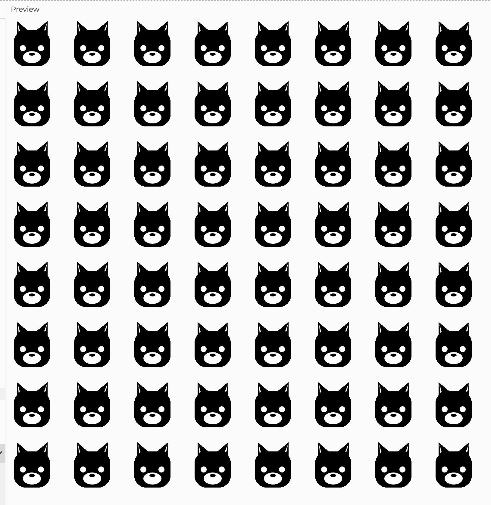
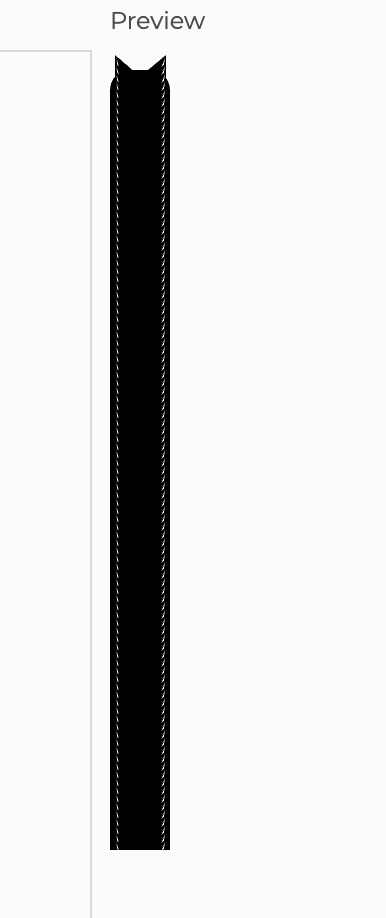
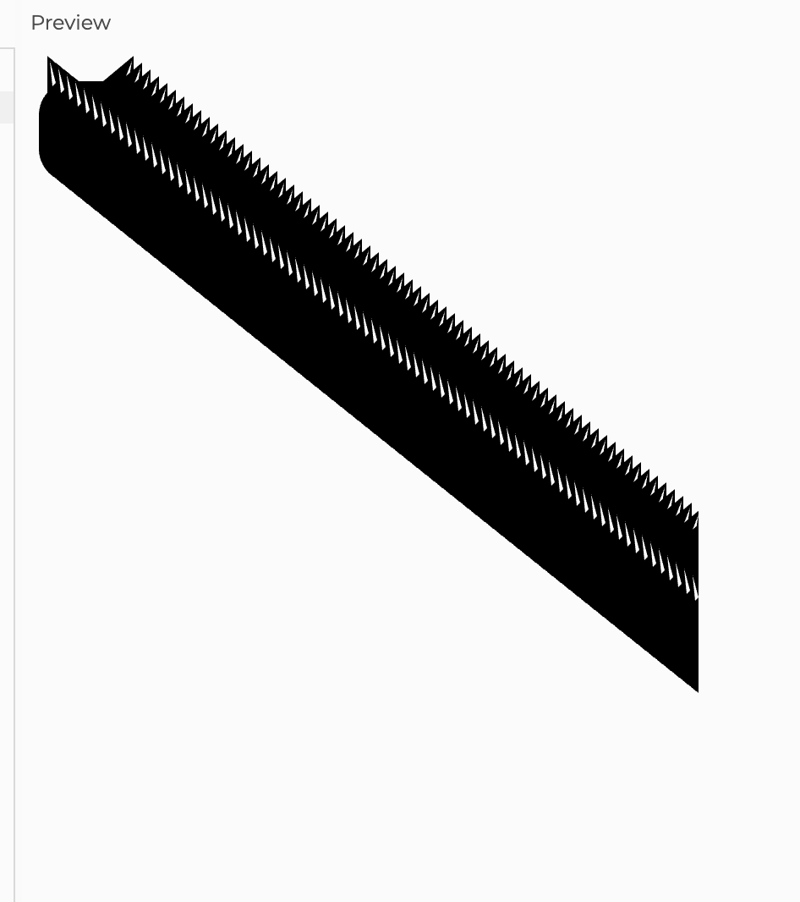
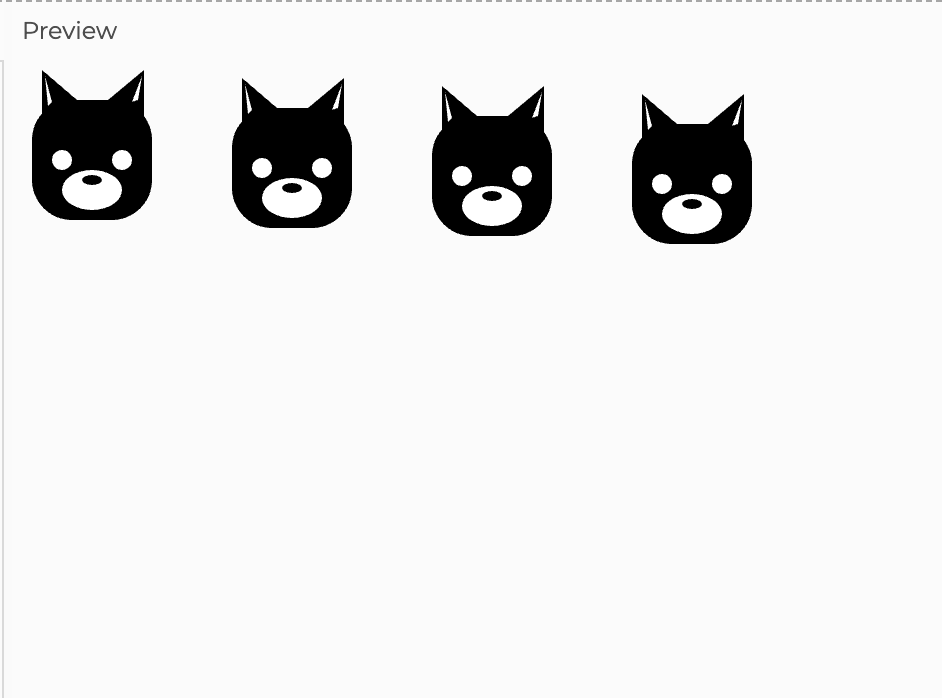

# Midterm

## What I did
- Drew a sketch of a cat



- Translated sketch into javaScript code to print it digitally



- Made it appear twice (yay)



- Tessellated it



- Final tessallation code (The one I used my brain for the most because the others were kind of simple)

```
function setup() {
  createCanvas(800, 800); 
  noStroke(); 
}

function drawObject(x, y, s) {
  push();
  translate(x, y);
  scale(1,1);
   fill(0); // Fill in with black color
  square(10, 20, 60, 20);
  fill(300)
 ellipse(25, 50, 10, 10)
 ellipse(55, 50, 10, 10)
 ellipse(40, 65, 30, 20)
  fill(0)
 ellipse(40, 60, 10, 5) 
 triangle(15, 35, 15, 5, 50, 35)
 triangle(66, 35, 66, 5, 30, 35)
  fill(300)
  triangle(18, 23, 16.5, 8, 20, 21)
  triangle(63, 20, 65, 8, 60, 21)
  pop();
}

function draw() {
 for (y = 0; y < 800; y += 100) {
  for (x = 0; x < 800; x += 100) {
 drawObject(x, y, x, y);   
  }
 }
}

```

## Problems I faced
- The first three phases were actually quite easy. 
- Phases 1 and 3 in particular were quite simply, because phase 1 just involved drawing out each component of my image, while for phase 3 I directly referenced the example phase 3 code from the class repository. 
- While the code I submitted is basically identital to the class code (in terms of getting the image to function in a particular way) I did try messing around with it and shifting the two images around by changing the coordinate numbers in the drawObject(x, y, s) command line at the end.
- Phase 2 was a bit more complicated in that I had to figure out what each number (e.g. in ellipse(x1, y1, x2, y2)) meant and how they would affect the printed image, but that was also quite easy to get a hang of. It was a bit more difficult to get the triangles printed the way I wanted since I was dealing with 3 points (so basically like (x1, y1, x2, y2, x3, y3)), but I also managed to get that figured out pretty quickly. 

- The biggest problem I faced was for Phase 4, when tessalating the image. 
- For this code, I heavily referenced this code from the class repository, specifically the codealong.js file from the Control Flow lecture folder. 

```

let size = 8;
let board = " ";

for (let y = 0; y < size; y++) { 
  for (let x = 0; x < size; x++) {
    if ((x + y) % 2 === 0) {
      board += " ";
    } else {
      board += "#"; 
    }
  }
  board += "\n";
}
console.log(board);

```


### Fail 1

- Actually, for the first few wrong codes, I was referencing this code from the class repository:

```
let y = 0.0;

function draw() {
  line(0, y, 100, y);
  y = y + 0.5;
}

```

- It prints animated lines going downward, so I thought that this when applied to my image would print them in a row that fills downwards (I was wrong)

```
function setup() {
  createCanvas(400, 400);
  noStroke();
}

function drawObject(x, y, s) {
  push();
  translate(x, y);
  scale(0.5,0.5);
   fill(0); // Fill in with black color
  square(10, 20, 60, 20);
  fill(300)
ellipse(25, 50, 10, 10)
ellipse(55, 50, 10, 10)
 ellipse(40, 65, 30, 20)
  fill(0)
 ellipse(40, 60, 10, 5) 
 triangle(15, 35, 15, 5, 50, 35)
 triangle(66, 35, 66, 5, 30, 35)
  fill(300)
  triangle(18, 23, 16.5, 8, 20, 21)
  triangle(63, 20, 65, 8, 60, 21)
  pop();
}

let y = 0.0 
function draw() {
  drawObject(0, y, 0, y);
   y +=4;
} 

```

- This would just continuously and endlessly print my object in a singular vertical straight column. 




### Fail 2

- I thought that since I wrote (0, y, 0, y), I was only getting one line of my image being printed vertically downwards, so I thought I guess that by making x a variable the same way I did y would help create rows? 

```

function setup() {
  createCanvas(400, 400);
  noStroke();
}

function drawObject(x, y, s) {
  push();
  translate(x, y);
  scale(1,1);
   fill(0); // Fill in with black color
  square(10, 20, 60, 20);
  fill(300)
 ellipse(25, 50, 10, 10)
 ellipse(55, 50, 10, 10)
 ellipse(40, 65, 30, 20)
  fill(0)
 ellipse(40, 60, 10, 5) 
 triangle(15, 35, 15, 5, 50, 35)
 triangle(66, 35, 66, 5, 30, 35)
  fill(300)
  triangle(18, 23, 16.5, 8, 20, 21)
  triangle(63, 20, 65, 8, 60, 21)
  pop();
}

let y = 0.0 
let x = 0.0 
function draw() {
  drawObject(x, y, x, y);
  x +=5; 
  y +=4;
}

```

- I made the image a bit bigger by increasing the scale by 100%, but this code would print my image in a diagonal, consecutive and eternal line. 
- I guess even though I did that with the x values, it still registered it as appearing once at a time (something like that I don't really know how to explain it but either way this code was getting still it to print as a singular column rather than multiple). 



### Fail 3 

- This one I referenced my Phase 3 code a little, I thought that since x affects the horizontal axis, in order to get a row to appear below the first one, I should have the x+=100 in order to get a second image to appear like spaced out but right next to the first one?

```

function setup() {
  createCanvas(400, 400);
  noStroke();
}

function drawObject(x, y, s) {
  push();
  translate(x, y);
  scale(1,1);
   fill(0); // Fill in with black color
  square(10, 20, 60, 20);
  fill(300)
 ellipse(25, 50, 10, 10)
 ellipse(55, 50, 10, 10)
 ellipse(40, 65, 30, 20)
  fill(0)
 ellipse(40, 60, 10, 5) 
 triangle(15, 35, 15, 5, 50, 35)
 triangle(66, 35, 66, 5, 30, 35)
  fill(300)
  triangle(18, 23, 16.5, 8, 20, 21)
  triangle(63, 20, 65, 8, 60, 21)
  pop();
}

let y = 0.0 
let x = 0.0 
function draw() {
  drawObject(x, y, x, y);
  x +=100; 
  y +=4;
}

```

- It resulted in something a bit closer to what I needed to get, though it only showed singular horizontal line of my image repeated 4 times.
- I assume the image is actually repeated eternally, but I only saw it appear 4 times because my canvas is set to dimensions of 400x400 while my image scales 100x100. 




- Honestly after this one there were just so many variations I did with extremely minor changes, all of which continued to give me the similar results OR just wouldn't print anything at all.

### Final

- This one I finally referenced the control flow nested loop code. I actually wasn't too sure how to apply it at first because the class repository nested loop code is for console.log and I thought I had to apply by the "size" and "board" parameters.
- This was actually not needed because the createCanvas function for defining the size of the canvas already fulfilled the "size" role from the original code. 
- Essentially I just used this section of the code to create my columns and rows (and anyway in the original code there are notes that literally label these two lines as the accumulator for the columns/rows). 

```
for (let y = 0; y < size; y++) { 
  for (let x = 0; x < size; x++) {

```

- And then I just slapped the drawObject(x, y, x, y) at the end to substitute for console.log(board)
- At this point I lowkey didn't think it was gonna work lol
- And surprise it did work and I actually got up and walked around for a bit out of shock.


```
function setup() {
  createCanvas(800, 800); 
  noStroke(); 
}

function drawObject(x, y, s) {
  push();
  translate(x, y);
  scale(1,1);
   fill(0); // Fill in with black color
  square(10, 20, 60, 20);
  fill(300)
 ellipse(25, 50, 10, 10)
 ellipse(55, 50, 10, 10)
 ellipse(40, 65, 30, 20)
  fill(0)
 ellipse(40, 60, 10, 5) 
 triangle(15, 35, 15, 5, 50, 35)
 triangle(66, 35, 66, 5, 30, 35)
  fill(300)
  triangle(18, 23, 16.5, 8, 20, 21)
  triangle(63, 20, 65, 8, 60, 21)
  pop();
}

function draw() {
 for (y = 0; y < 800; y += 100) {
  for (x = 0; x < 800; x += 100) {
 drawObject(x, y, x, y);   
  }
 }
}

```

- I increased my canvas dimensions to 800x800 so that I could see more. Since this code worked, I also tried changing the canvas size a few times (200x100, 400x600, etc.) to see if it would change the number of times I saw the image. (it worked)
- The only problem with this code is that if I wanted to change the parameters of my canvas, I would have to go back into the last few lines of the code and change the for for x/y commands. 


